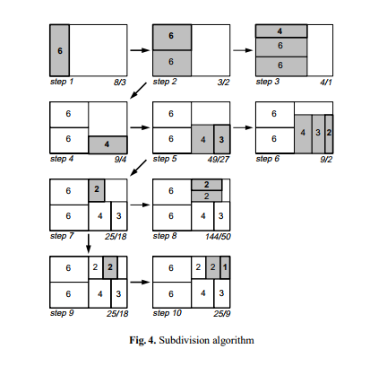

# treemep

给出一系列面积数值，将它们拼合在一个矩形中。

目标是minimiaze max{所有矩形的长宽比（ratio）}。

这里定义ratio不小于1。

---

<b>reference:</b> 

<i>Bruls M., Huizing K., van Wijk J.J. (2000) Squarified Treemaps. In: de Leeuw W.C., van Liere R. (eds) Data Visualization 2000. Eurographics. Springer, Vienna</i>